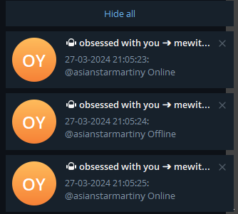

# SPY

**notifies you when the victim has been online and offline**




## Install

` pip install telethon`
 
## Setup

Create your [telegram application](https://my.telegram.org/apps) and replace API_HASH, API_ID with yours

```
API_HASH = 'your api hash'
API_ID = 'yuor api id'
```

Create [bot](https://t.me/BotFather) in your telegram client and copy bot token into app

```
BOT_TOKEN = "your bot token"
```

add the victim to your contact list. 

it is important that he or she shares his or her online status with you. 

see if the victim's profile has a when next to his status? If so, you're in luck, buy telegram premium and you can get his status even if he doesn't share it with you.

If there is no when, there is no point in buying a subscription, then ask the victim to share their status with you or accept the fact that you will not be able to track them.

## Run

  1. Run `start.bat`
  
  2. Then input **your telegram account number** which will be sending requests to get users online status (**Do not enter a bot token as this will not work**)
  
  2. Then input code in console from telegram

  3. Enter two-step verification in the console if it is enabled it (**important to know it is not displayed in the console**)


### Commands
  
  Write /help to your bot to see usage information.

```
/start - start online monitoring 
/stop - stop online monitoring 
/help - show help 
/add - add user to monitoring list "/add username (without @)"
/list - show added users
/clear - clear user list
/remove - remove user from list with position in list (to show use /list command)"/remove 1"
/setdelay - set delay between user check in seconds
/logs - display command log
/clearlogs - clear the command log file
/cleardata - reset configuration
/disconnect - disconnect bot
/getall - status
```

## ENJOY 
